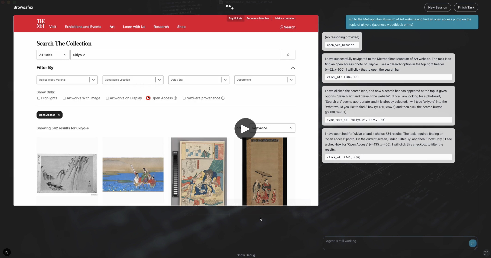

# Browsafex

A web application wrapper for the [Gemini 2.5 Computer Use model](https://blog.google/technology/google-deepmind/gemini-computer-use-model/). It connects to a web browser and implements all the functionality required by the model to interact with websites.

Check out this demo video to see Browsafex in action:

<div align="center">

[](https://youtu.be/2qL5L4xzgWo)

</div>

## Prerequisites

- Node.js (version 18 or higher)
- Yarn package manager
- Google Chrome browser
- Gemini API key

## Configuration

To use the web app, you need to provide minimal configuration by adding your Gemini API key and a working Chrome browser instance to the `.env` file.

```
GEMINI_API_KEY=your-api-key
BROWSER_URL=http://localhost:9222
```

### Gemini API Key

You can obtain a Gemini API key from the Google Cloud Console or more easily from the [Google AI Studio](https://aistudio.google.com/app/api-keys).

### Browser Instance

The app needs to connect to an existing Chrome browser instance with remote debugging enabled using the `--remote-debugging-port` flag. You can start one on your local machine with the following commands, depending on your operating system:

**macOS:**

```
/Applications/Google\ Chrome.app/Contents/MacOS/Google\ Chrome --remote-debugging-port=9222
```

**Windows:**

```
C:\Program Files\Google\Chrome\Application\chrome.exe --remote-debugging-port=9222
```

**Linux:**

```
google-chrome --remote-debugging-port=9222
```

Then set the `BROWSER_URL` environment variable to the URL of the Chrome instance:

```
BROWSER_URL=http://localhost:9222
```

## Usage

Before starting the web app, make sure you have all dependencies installed:

```
yarn install
```

Then start the web app with the following command:

```
yarn dev
```

The web app will be available at `http://localhost:3000` by default. You can change the port by setting the `PORT` environment variable.

To start the web app in production mode:

```
yarn build
yarn start
```

## How it works

The web app is a Next.js application that runs worker threads in the background for each session and updates the frontend using Server-Sent Events (SSE). This means you cannot run it in a serverless environment like Vercel or Netlify—you need a proper server instead. Currently, sessions are stored in memory and are lost when the server restarts.

## Known limitations

This is an early prototype of a UI to interact with the Gemini Computer Use model and may have some limitations and bugs. The following are known limitations:

- Sessions are stored in memory and are lost when the server restarts
- The browser instance sometimes gets stuck and needs to be restarted
- No safety checks for potentially dangerous actions

## Security Considerations

⚠️ **Important Security Warning**

This application provides AI agents with direct browser control capabilities. Please be aware of the following security risks:

- **No built-in safety checks**: The agent can perform any action a human could do in a browser
- **Sensitive data exposure**: The agent can access any information visible in the browser
- **Financial transactions**: The agent could potentially make purchases or transfers
- **Account access**: The agent can log into accounts and access personal data

**Recommendations:**

- Only use this tool on trusted websites
- Never provide access to banking or financial websites
- Monitor the agent's actions closely
- Use in a controlled environment with limited network access
- Consider using a separate browser profile for testing

## About

I built this web app to experiment with the Gemini Computer Use model and learn more about its capabilities. I'm using it for some automation tasks, and it works quite well in some cases while failing in others. Use at your own risk and don't allow the agent to perform dangerous actions.

Created by [Vladimir Haltakov](https://haltakov.net). You can find me on [X](https://x.com/haltakov). Check out my other open-source project [Simple Photo Gallery](https://simple.photo).
