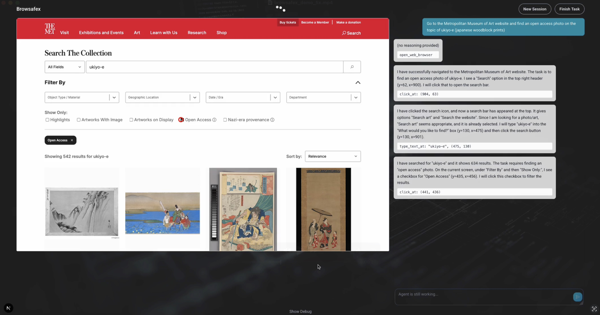

# Browsafex

This is a web application wrapper for the [Gemini 2.5 Computer Use model](https://blog.google/technology/google-deepmind/gemini-computer-use-model/). It connects to a web browser and implements all the functionality required by the model to interact with websites.

Check out this demo video to see Browsafex in action:

<div align="center">

[](https://youtu.be/2qL5L4xzgWo)

</div>

## Configuration

To use the web app you need to do a minimal configuration by providing your Gemini API key and a working Chrome browser instance in the `.env` file.

```
GEMINI_API_KEY=your-api-key
BROWSER_URL=http://localhost:9222
```

### Gemini API Key

You can obtain a Gemini API key from the Google Cloud Console or easier from the [Google AI Studio](https://aistudio.google.com/app/api-keys).

### Browser Instance

The app needs to connect to an existing Chrome browser instance with remote debugging enabled using the `--remote-debugging-port` flag. You can start one on your local machine with the following command, depending on your operating system:

On MacOS:

```
/Applications/Google\ Chrome.app/Contents/MacOS/Google\ Chrome --remote-debugging-port=9222
```

On Windows:

```
C:\Program Files\Google\Chrome\Application\chrome.exe --remote-debugging-port=9222
```

On Linux:

```
google-chrome --remote-debugging-port=9222
```

Then you can set the `BROWSER_URL` environment variable to the URL of the Chrome instance.

```
BROWSER_URL=http://localhost:9222
```

## Usage

Before starting the web app make sure you have all dependencies installed.

```
yarn install
```

Then you can start the web app with the following command:

```
yarn dev
```

To start the web app in production mode:

```
yarn build
yarn start
```

## How it works

The web app is a Next.js application that runs worker threads in the background for each session and updates the frontend using Server-Sent Events (SSE). This means that you cannot run it in a serverless environment like Vercel or Netlify, but you need a proper server instead. Currently, sessions are stored in memory and are lost when the server restarts.

## Known limitations

This is an early prototype of a UI to interact with the Gemini Computer Use model and may have some limitations and bugs. THe following are known limitations:

- Sessions are stored in memory and are lost when the server restarts.
- The browser instance sometimes gets stuck and needs to be restarted.
- No safety checks for potentially dangerous actions.

## About

I built this web app to experiment with the Gemini Computer Use model and to learn more about the capabilities of the model. I'm using it for some automation tasks and it works quite well in some cases, while it fails in other cases. Use at your own risk and don't allow the agent to perform dangerous actions.

Created by [Vladimit Haltakov](https://haltakov.net). You can find me on [X](https://x.com/haltakov). Check out my other open-source project [Simple Photo Gallery](https://simple.photo).
